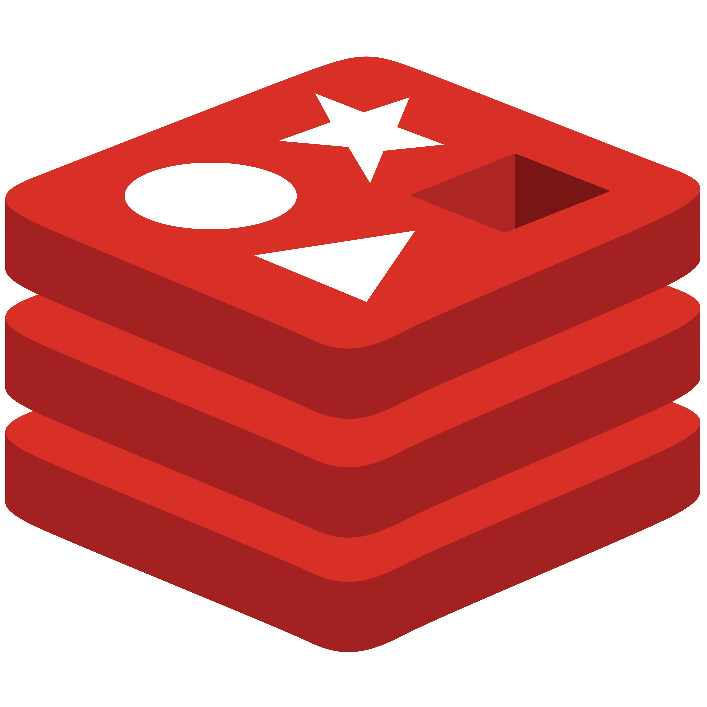

# Asset Management System

<p align="center">
  
  
  
  
</p>


Asset Management System is a web application built using Django to manage company assets. The application supports asset CRUD operations, user and group management, and advanced CSV import/export functionality with real-time progress tracking using Celery and Redis. The user interface is based on SB Admin 2 with Bootstrap, jQuery, and DataTables.

---

## Demo Video

[](https://www.youtube.com/watch?v=I3uBuUW-hvo)

---

## Table of Contents

1. [Introduction](#introduction)
2. [Features](#features)
3. [Technologies Used](#technologies-used)
4. [Project Structure](#project-structure)
5. [Installation and Setup](#installation-and-setup)
6. [Running the Project](#running-the-project)
7. [Testing](#testing)
8. [Optimizations](#optimizations)
9. [Contact](#contact)

---

## Introduction

Asset Management System helps organizations track and manage their assets efficiently. It includes a custom dashboard, asset CRUD operations, and robust CSV import/export capabilities. The CSV import process supports multi-step column mapping, allowing users to map CSV columns to the asset model fields. Import and export tasks are processed asynchronously using Celery with Redis as the broker, and a real-time progress page is provided for user feedback.

---

## Features

- **Custom Dashboard:** A modern admin interface based on SB Admin 2.
- **Asset Management:** Create, update, delete, and view asset details.
- **CSV Import/Export:**  
  - Multi-step CSV import with custom column mapping.
  - Real-time progress tracking during CSV import.
  - Export selected columns from asset records to CSV.
- **User and Group Management:** Integrated with Django’s built-in authentication and admin.
- **API Support:** CRUD operations available through Django REST Framework.
- **Asynchronous Processing:** Heavy tasks are handled by Celery with Redis.
- **Logging and Error Handling:** Detailed logging for easier debugging and maintenance.

---

## Technologies Used

- **Python 3.12**
- **Django 5.1.5**
- **Django REST Framework**
- **Celery**
- **Redis**
- **SB Admin 2** (Bootstrap, jQuery, DataTables)
- Additional libraries: `csv`, `uuid`

---

## Project Structure

<pre>
asset_management/
├── config/             # Django project settings, URLs, WSGI/ASGI, celery.py, etc.
├── dashboard/          # Dashboard application (statistics, navigation, etc.)
├── assets/             # Asset management app (models, views, serializers, tests)
├── users/              # User management
├── groups/             # Group management
├── import_export/      # CSV import/export app (views, tasks, utils, tests)
├── templates/          # HTML templates (base, partials, dashboard, assets, import_export, users, groups, etc.)
├── static/             # Static files (CSS, JS, SB Admin 2, vendor libraries)
└── manage.py
</pre>

## Installation and Setup

1. **Clone the repository:**

   ```bash
   git clone <repository_url>
   cd asset_management
   ```

2. **Create and activate a virtual environment:**

   ```bash
   python3 -m venv venv
   source venv/bin/activate   # On Windows: venv\Scripts\activate
   ```

3. **Install dependencies:**

   ```bash
   pip install -r requirements.txt
   ```

4. **Apply database migrations and create a superuser:**

   ```bash
   python manage.py makemigrations
   python manage.py migrate
   python manage.py createsuperuser
   ```

---

## Running the Project

### Setting up Celery and Redis

1. **Install Redis:**

   On macOS (using Homebrew):

   ```bash
   brew install redis
   brew services start redis
   ```

   Or using Docker:

   ```bash
   docker run -d -p 6379:6379 --name redis_server redis
   ```

2. **Configure Celery:** In `config/celery.py`:

   ```python
   import os
   from celery import Celery

   os.environ.setdefault('DJANGO_SETTINGS_MODULE', 'config.settings')
   celery_app = Celery('asset_management')
   celery_app.config_from_object('django.conf:settings', namespace='CELERY')
   celery_app.autodiscover_tasks()
   ```

   In `config/settings.py`, set:

   ```python
   CELERY_BROKER_URL = 'redis://127.0.0.1:6379/0'
   CELERY_RESULT_BACKEND = 'redis://127.0.0.1:6379/0'
   CELERY_TRACK_STARTED = True
   CELERY_TASK_IGNORE_RESULT = False
   ```

3. **Start the Celery Worker:** Open a new terminal in the project root and run:

   ```bash
   celery -A config worker -l info
   ```

### Starting the Django Server

Run the Django development server in another terminal:

```bash
python manage.py runserver
```

### Accessing the Application

- **Dashboard/Asset List:** `http://127.0.0.1:8000/`
- **Django Admin:** `http://127.0.0.1:8000/admin/`
- **CSV Import:** Navigate to `/import/upload/` to start the multi-step CSV import process.

---

## Testing

Run the test suite with:

```bash
python manage.py test
```

Tests are organized within each app’s `tests/` directory.

---

## Optimizations

- **Asynchronous Processing:** Heavy CSV import/export tasks are handled by Celery to keep the web server responsive.
- **Custom Column Mapping:** Users can map CSV columns to asset fields, accommodating various CSV formats.
- **Real-Time Progress Tracking:** AJAX-based progress bar displays the import status in real time.
- **Efficient Asset Updates:** The import process uses `update_or_create` to overwrite duplicate asset codes, ensuring fast updates.
- **Modular Architecture:** Each component (dashboard, assets, import_export) is clearly separated for maintainability.
- **Detailed Logging:** Error logging is configured for easier troubleshooting.

---

## Contact

Author: dangindev
Email: haidang29productions@gmail.com
GitHub: [@dangindev](https://github.com/dangindev)
